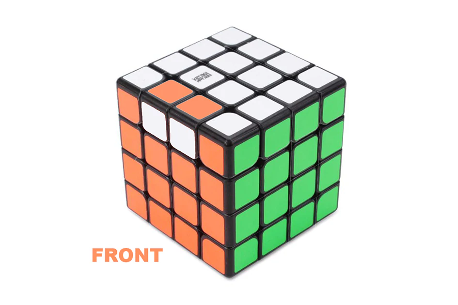
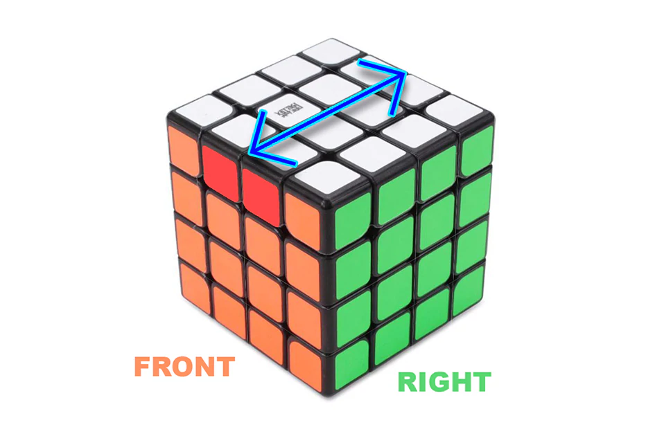
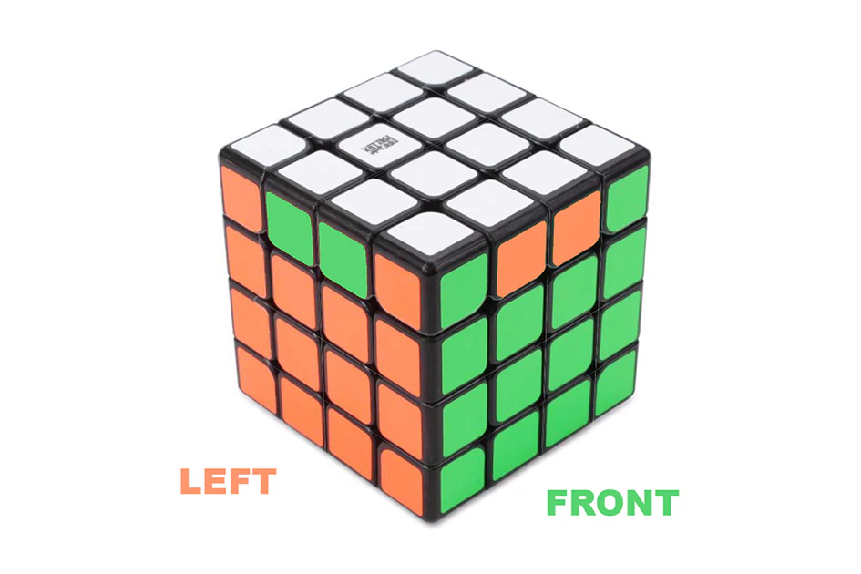
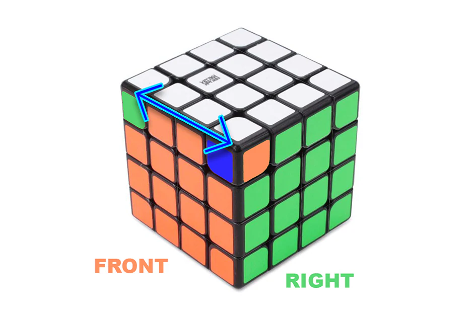
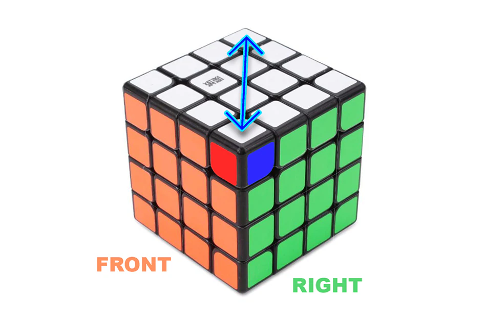
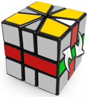
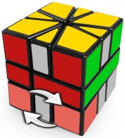
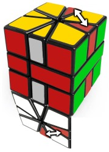
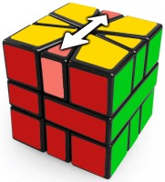

# Welcome to cube.terence.cloud

You will find here some algorithms for Rubik's cube that I often forget.

## 4x4

### Parity

#### OLL

    r2 B2 U2 l U2 r' U2 r U2 F2 r F2 l' B2 r2

#### PLL

    (Uu)2 (Ll)2 U2 l2 U2 (Ll)2 (Uu)2

    L2 D (Ff)2 (Ll)2 F2 l2 F2 (Ll)2 (Ff)2 D' L2

    (Uu)2 (Ll)2 U2 l2 U2 (Ll)2 (Uu)2 F' U' F U F R' F2 U F U F' U' F R

    (Uu)2 (Ll)2 U2 l2 U2 (Ll)2 (Uu)2 R U' L U2 R' U R L' U' L U2 R' U L' U

### Sources

* [kewbz.fr](https://www.kewbz.fr/blogs/solutions/4x4-parity-algorithms-oll-pll-algs-how-to-solve-a-4x4-rubiks-cube)

## Square One

### Swap top corners

    (1, 0) / (0, -3) / (0, 3) / (0, -3) / (0, -3) / (0, 6) / (-1, 0)

### Edge to their layers

    (1, 0) / (0, -3) / (0, -3) / (-1, -1) / (1, 4) / (0, 3) / (-1, 0)

### Swap bottom corners

    / (3, -3) / (0, 3) / (-3, 0) / (3, 0) / (-3, 0) /

### Swap edges

    (0, 2) / (0, -3) / (1, 1) / (-1, 2) / (0, -2)

### Parity

    / (3,3) / (1,0) / (-2,-2) / (2,0) / (2,2) / (-1,0) / (-3,-3) / (-2,0) / (3,3) / (3,0) / (-1,-1) / (-3,0) / (1,1) / (-4,-3)
